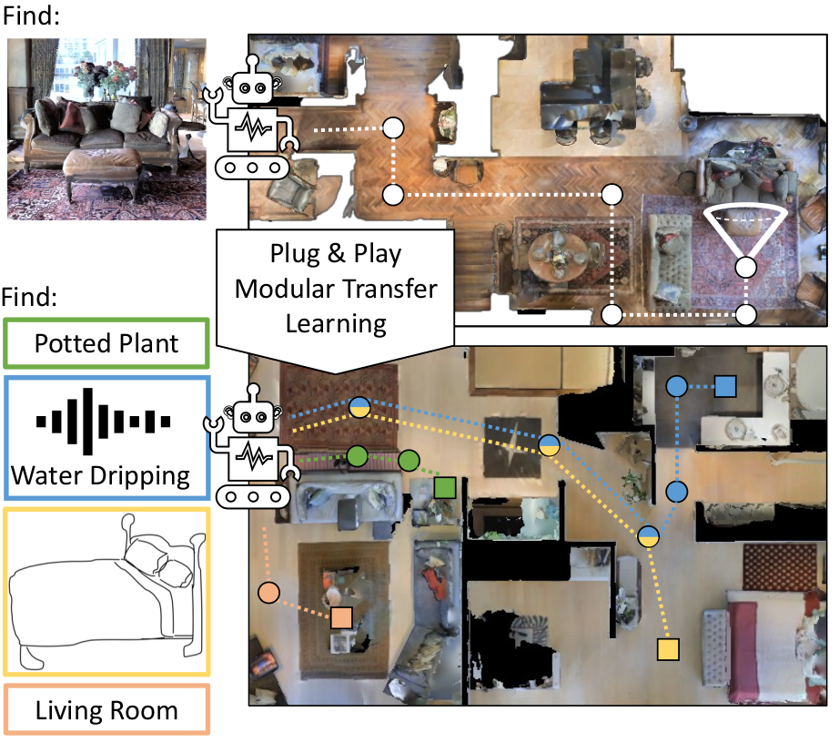

# Zero Experience Required

This repository contains a PyTorch implementation of our CVPR 2022 paper:

[Zero Experience Required: Plug & Play Modular Transfer Learning
for Semantic Visual Navigation](https://arxiv.org/pdf/2202.02440.pdf)<br />
Ziad Al-Halah, Santhosh K. Ramakrishnan, Kristen Grauman<br />
The University of Texas at Austin, Facebook AI Research

Project website: [https://vision.cs.utexas.edu/projects/zsel](https://vision.cs.utexas.edu/projects/zsel)

<p align="center">
  
</p>


## Abstract

In reinforcement learning for visual navigation, it is common to develop a model for each new task, and train that model from scratch with task-specific interactions in 3D environments. However, this process is expensive; massive amounts of interactions are needed for the model to generalize well. Moreover, this process is repeated whenever there is a change in the task type or the goal modality. We present a unified approach to visual navigation using a novel modular transfer learning model. Our model can effectively leverage its experience from one source task and apply it to multiple target tasks (e.g., ObjectNav, RoomNav, ViewNav) with various goal modalities (e.g., image, sketch, audio, label). Furthermore, our model enables zero-shot experience learning, whereby it can solve the target tasks without receiving any task-specific interactive training. Our experiments on multiple photorealistic datasets and challenging tasks show that our approach learns faster, generalizes better, and outperforms SoTA models by a significant margin.


## Installation

Clone the current repository and required submodules:

```
git clone git@github.com:ziadalh/zero_experience_required.git
cd zero_experience_required
git submodule init
git submodule update
export ZER_ROOT=$PWD
```

Create conda environment:

```
conda create --name zer python=3.6.10
conda activate zer
```

Install pytorch:

```
conda install pytorch==1.7.0 torchvision==0.8.0 cudatoolkit=10.2 -c pytorch
```

Install other requirements for this repository:

```
pip install -r requirements.txt
```

Install [habitat-lab](https://github.com/facebookresearch/habitat-lab) and [habitat-sim](https://github.com/facebookresearch/habitat-sim):

```
cd $ZER_ROOT/dependencies/habitat-lab
pip install -r requirements.txt
python setup.py develop --all

cd $ZER_ROOT/dependencies/habitat-sim
pip install -r requirements.txt
python setup.py install --headless --with-cuda
```


## Datasets

You can download the datasets used in this work from the following table:

| Task       |   Dataset  | Split   |    File                    |    Install Path            |
|------------|:----------:|:-------:|:--------------------------:|:--------------------------:|
| ImageNav   |   Gibson   | train   |  [imagenav_gibson_train](https://utexas.box.com/s/jaw3ekpzugqfo7i49jw0b0jq3s1odqb0) | `$ZER_ROOT/data/datasets/zer/imagenav/gibson/v1/` |
| ImageNav   |   Gibson   | val     |  [imagenav_gibson_val](https://utexas.box.com/s/3rzj0nn9nqk4m8ni99ozwjtiqrit32i6)   | `$ZER_ROOT/data/datasets/zer/imagenav/gibson/v1/` |
| ImageNav   |   HM3D     | val     |  [imagenav_hm3d_val](https://utexas.box.com/s/qwccagc0afbj5h0940h25gjr8fy56v5o)     | `$ZER_ROOT/data/datasets/zer/imagenav/hm3d/v1/` |
| ImageNav   |   MP3D     | test    |  [imagenav_mp3d_test](https://utexas.box.com/s/0vb7yv0472gp4t48z9p10wnole8siki9)    | `$ZER_ROOT/data/datasets/zer/imagenav/mp3d/v1/` |


Download the respective scenes from [Gibson](http://gibsonenv.stanford.edu/database/), [HM3D](https://aihabitat.org/datasets/hm3d/), and [Matterport3D](https://niessner.github.io/Matterport/). Save (or link) the scenes under `$ZER_ROOT/data/scene_datasets/<DATASET_NAME>` where `<DATASET_NAME>` is `gibson`, `hm3d`, or `mp3d`.


## Pretrained models

Download the pretrained model from here:

| Task       |   Training Data  |   Model                    |
|------------|:----------------:|:--------------------------:|
| ImageNav   |   Gibson         |  [imagenav_gibson](https://utexas.box.com/s/asls2k762v7714e7unqhtera6g8c36z0) |


## Evaluating ImageNav Models

The  evaluation configurations are provided for our ImageNav model in `config/imagenav/eval_ppo_imagenav_rgb.yaml`

Make sure that the datasets paths are correct in `DATASET.DATA_PATH` of the respective dataset configuration file in `config/imagenav/`

To evaluate our ImageNav model on Gibson `<SPLIT_NAME>` (val_easy, val_medium, val_hard) split, run the following command:

```
python -u run.py \
  --exp-config config/imagenav/eval_ppo_imagenav_rgb.yaml \
  --run-type eval \
  --output-dir <OUTPUT_DIR>  \
  EVAL.SPLIT <SPLIT_NAME> \
  EVAL_CKPT_PATH_DIR <PATH_TO_IMAGENAV_GIBSON_MODEL>
```

For cross-evaluation on HM3D `<SPLIT_NAME>` (val_easy, val_medium, val_hard):

```
python -u run.py \
  --exp-config config/imagenav/eval_ppo_imagenav_rgb.yaml \
  --run-type eval \
  --output-dir <OUTPUT_DIR>  \
  EVAL.SPLIT <SPLIT_NAME> \
  EVAL_CKPT_PATH_DIR <PATH_TO_IMAGENAV_GIBSON_MODEL> \
  BASE_TASK_CONFIG_PATH config/imagenav/hm3d/imagenav_rgb.yaml
```

For cross-evaluation on MP3D `<SPLIT_NAME>` (test_easy, test_medium, test_hard):

```
python -u run.py \
  --exp-config config/imagenav/eval_ppo_imagenav_rgb.yaml \
  --run-type eval \
  --output-dir <OUTPUT_DIR>  \
  EVAL.SPLIT <SPLIT_NAME> \
  EVAL_CKPT_PATH_DIR <PATH_TO_IMAGENAV_GIBSON_MODEL> \
  BASE_TASK_CONFIG_PATH config/imagenav/mp3d/imagenav_rgb.yaml
```


## Zero-Shot Experience Learning

We will release soon the code and data related to the zero-shot experience learning (ZSEL) experiments in the paper.


## Acknowledgements

In our work, we used parts of [Habitat Lab](https://github.com/facebookresearch/habitat-lab) and extended it. Some of the ImageNav datasets are adapted from [Hahn et al.](https://arxiv.org/abs/2110.09470) and [Mezghani et al.](https://arxiv.org/abs/2101.05181). Please see [our paper](https://arxiv.org/pdf/2202.02440.pdf) for details.


## Citation

```
@inproceedings{al-halah2022zsel,
    author = {Ziad Al-Halah and Santhosh K. Ramakrishnan and Kristen Grauman},
    title = {{Zero Experience Required: Plug \& Play Modular Transfer Learning for Semantic Visual Navigation}},
    year = {2022},
    booktitle = {IEEE Conference on Computer Vision and Pattern Recognition (CVPR)},
    arxivId = {2202.02440}
}
```

## License
This project is released under the MIT license, as found in the [LICENSE](LICENSE) file.
